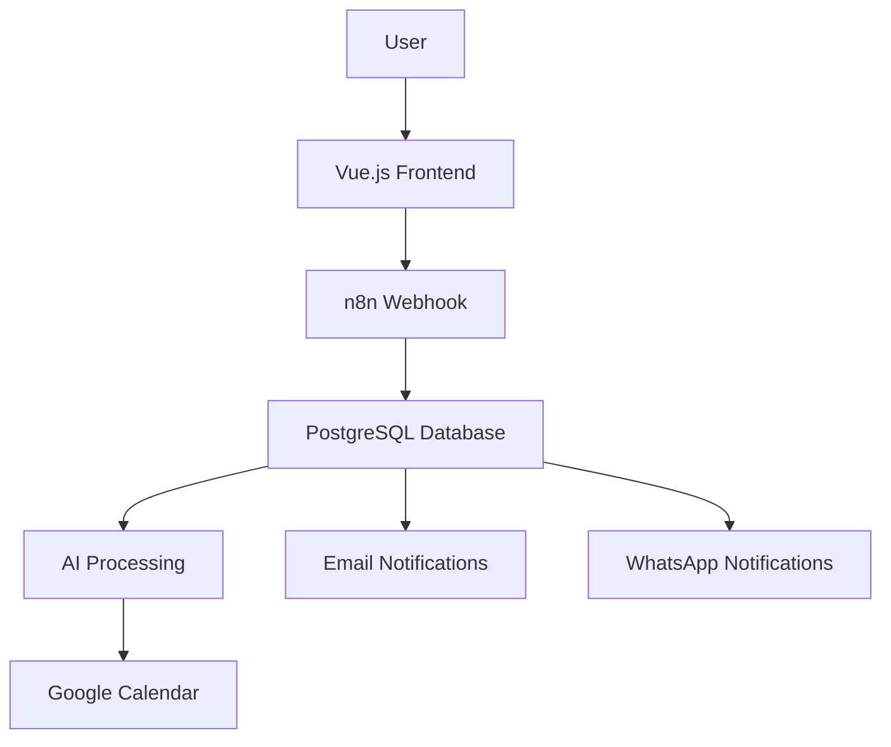

¡Excelente! Te voy a mejorar el README con **escudos profesionales** y una estructura más visual como WebTwin:

---

# 🚀 Automated Project Manager

<div align="center">


**Modern Task Management with AI-Powered Automation**

[](https://github.com/pashitox/automated-project-manager)
[](LICENSE)
[](https://github.com/pashitox/automated-project-manager)

</div>

## 📋 Table of Contents
- [✨ Features](#-features)
- [🏗️ Architecture](#️-architecture)
- [🚀 Quick Start](#-quick-start)
- [🛠️ Tech Stack](#️-tech-stack)
- [📁 Project Structure](#-project-structure)
- [🔧 API Endpoints](#-api-endpoints)
- [📊 Dashboard Preview](#-dashboard-preview)
- [🔮 Roadmap](#-roadmap)
- [👨‍💻 Author](#-author)

## ✨ Features

<div align="center">

| 🎯 Frontend | 🔧 Backend | 📊 Database | 📱 Notifications |
|-------------|------------|-------------|------------------|
| Vue.js 3 + Composition API | n8n Workflows | PostgreSQL | Gmail SMTP |
| Pinia State Management | Webhook Processing | Real-time Data | WhatsApp (Twilio) |
| Element Plus UI | AI Integration | Secure Storage | Multi-channel |
| Real-time Dashboard | Automation Engine | Scalable | Instant Alerts |

</div>

### 🎯 Core Capabilities
- ✅ **Task Management** - Create, list, filter, and track tasks
- ✅ **Real-time Dashboard** - Live statistics and analytics
- ✅ **AI-Powered Features** - Effort estimation and task analysis
- ✅ **Multi-channel Notifications** - Email + WhatsApp instantly
- ✅ **Workflow Automation** - End-to-end process automation
- ✅ **Production Ready** - Dockerized and scalable

## 🏗️ Architecture



## 🚀 Quick Start

### Prerequisites
- Docker & Docker Compose
- Node.js 18+ (for development)

### Installation

1. **Clone the repository**
```bash
git clone https://github.com/pashitox/automated-project-manager.git
cd automated-project-manager
```

2. **Start the system**
```bash
# Production deployment
docker-compose up -d

# Or use the helper script
./start-project.sh
```

3. **Access the application**
```
Frontend Dashboard: http://localhost:5173
n8n Interface:     http://localhost:5678
```

4. **Create your first task**
   - Open the dashboard
   - Fill in task details
   - Watch notifications arrive instantly! 🎉

### Environment Setup
Create `.env` file:
```env
# Database
POSTGRES_DB=automation_db
POSTGRES_USER=postgres
POSTGRES_PASSWORD=your_password

# n8n
N8N_BASIC_AUTH_ACTIVE=true
N8N_BASIC_AUTH_USER=admin
N8N_BASIC_AUTH_PASSWORD=your_password

# APIs
OPENAI_API_KEY=your_openai_key
TWILIO_ACCOUNT_SID=your_twilio_sid
TWILIO_AUTH_TOKEN=your_twilio_token
```

## 🛠️ Tech Stack

<div align="center">

### Frontend


### Backend & Automation


### Notifications & AI


### DevOps


</div>

## 📁 Project Structure

```
automated-project-manager/
├── 🎨 frontend/                 # Vue.js Application
│   ├── src/
│   │   ├── components/
│   │   │   ├── Dashboard.vue    # Main dashboard with stats
│   │   │   ├── TaskForm.vue     # Task creation form
│   │   │   └── TaskList.vue     # Tasks table with filters
│   │   ├── stores/
│   │   │   └── tasks.js         # Pinia store for state management
│   │   ├── composables/
│   │   │   └── useApi.js        # API communication layer
│   │   └── main.js              # Vue application entry
│   └── package.json
│
├── ⚙️ n8n/                      # Automation Workflows
│   ├── workflows/
│   │   ├── create-task.json     # Task creation flow
│   │   └── get-tasks-list.json  # Task retrieval flow
│   └── credentials/             # API credentials (gitignored)
│
├── 🗄️ database/
│   └── schema.sql               # PostgreSQL table definitions
│
├── 🐳 docker-compose.yml        # Multi-container deployment
├── 🔧 start-project.sh          # Development startup script
├── 🔧 stop-project.sh           # Safe shutdown script
└── 📄 README.md                 # This file
```

## 🔧 API Endpoints

### n8n Webhooks
| Method | Endpoint | Description |
|--------|----------|-------------|
| `POST` | `/webhook/create-task` | Create new task with notifications |
| `GET` | `/webhook/get-tasks-list` | Retrieve all tasks from database |

### Example Payload
```json
{
  "title": "Develop User Authentication",
  "description": "Implement login and registration endpoints",
  "priority": "high",
  "assignee": "dev@company.com"
}
```

## 📊 Dashboard Preview


**Features:**
- 📈 **Real-time Statistics** - Total tasks, completed, in progress, pending
- 🎯 **Priority Filtering** - Filter by high, medium, low priority
- 🔍 **Live Search** - Find tasks instantly
- 📱 **Responsive Design** - Works on all devices
- 🎨 **Modern UI** - Clean and professional interface

## 🔮 Roadmap

### ✅ Completed
- [x] Vue.js 3 frontend with Composition API
- [x] n8n backend automation workflows
- [x] PostgreSQL database integration
- [x] Multi-channel notifications (Email + WhatsApp)
- [x] Real-time dashboard with statistics
- [x] Docker containerization

### 🚧 In Progress
- [ ] Google Calendar integration
- [ ] AI-powered effort estimation
- [ ] Advanced reporting and analytics
- [ ] User authentication and roles

### 📅 Planned
- [ ] Slack/Discord notifications
- [ ] Mobile application
- [ ] Advanced AI features (task suggestions)
- [ ] API rate limiting and security
- [ ] Performance monitoring

## 👨‍💻 Author

<div align="center">

**Pashitox** - Full Stack Developer & Automation Specialist

[](https://github.com/pashitox)
[](https://pashitox.dev)
[](https://linkedin.com/in/pashitox)

**"Building the future of automation, one workflow at a time."**

</div>

## 📄 License

This project is licensed under the MIT License - see the [LICENSE](LICENSE) file for details.

---

<div align="center">

### ⭐ Star us on GitHub!

If this project helped you, please give it a star on [GitHub](https://github.com/pashitox/automated-project-manager)!

**Automated Project Manager** - Professional task management with AI-powered automation 🚀

</div>

---

